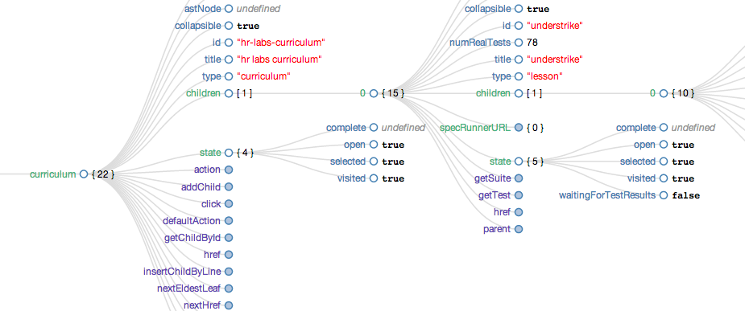

# Periscope

A sea-level view of your angular scope tree--with inline primitive editing.

Properties are sorted and colored by type class:

* objects and arrays (collections)
* undefined, null, string, number, boolean (primitives)
* functions and methods



#### _Caveat emptor_

This is alpha software--rough seas ahead.

# Up Periscope!

```
 <script src="lib/[_, $, d3, angular].js"></script>
 <script src="lib/periscope/periscope.js"></script>
 <link rel="stylesheet" href="lib/periscope/periscope.css"></script>
```

### Support:

If you want the good work to continue please support us on

* [PAYPAL](https://www.paypal.me/ishandutta2007)
* [BITCOIN ADDRESS: 3LZazKXG18Hxa3LLNAeKYZNtLzCxpv1LyD](https://www.coinbase.com/join/5a8e4a045b02c403bc3a9c0c)
